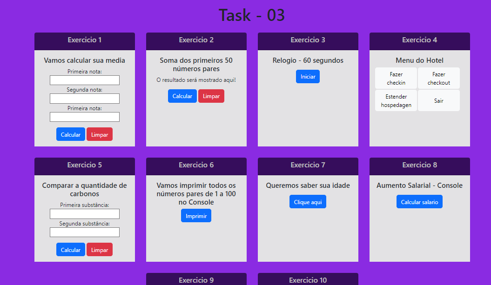

<h1 align="center"> JavaScript - Task 03</h1>

 Exercícios da aula 3 de JavaScript 

  <a href="#-tecnologias">Tecnologias</a>&nbsp;&nbsp;&nbsp;|&nbsp;&nbsp;&nbsp;
  <a href="#-sobre-o-projeto">Sobre o Projeto</a>&nbsp;&nbsp;&nbsp;

  

## 🚀 Tecnologias

Esse projeto foi desenvolvido com as seguintes tecnologias:

- HTML
- CSS
- JavaScript

## 💻 Sobre o Projeto

Criado para testar as atividades propostas em aula. As ativides que utilizam o console estão sinalizadas.
