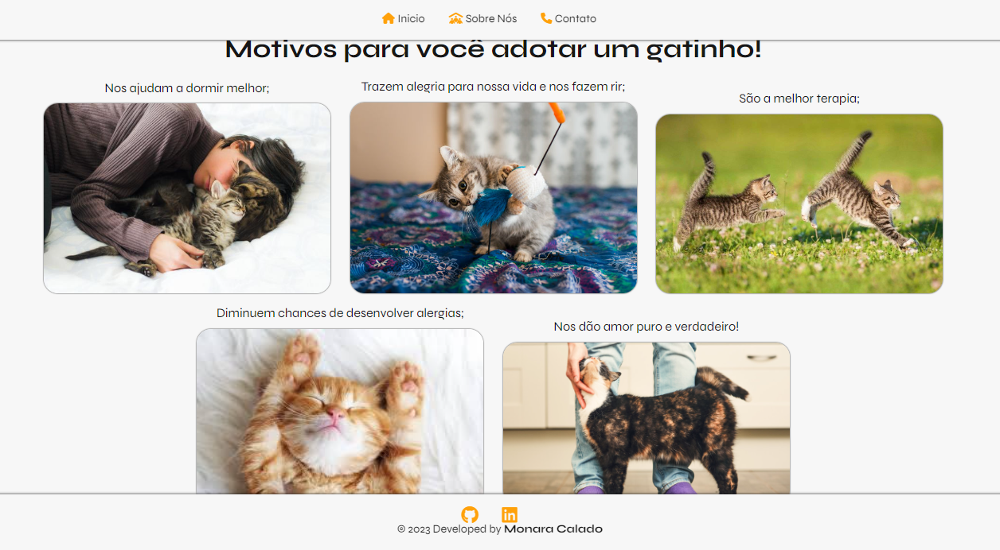

<h1 align="center"> Adote um Gatinho 😺 </h1>

 Motivos para adotar um gatinho
. 

  <a href="#-tecnologias">Tecnologias</a>&nbsp;&nbsp;&nbsp;|&nbsp;&nbsp;&nbsp;
  <a href="#-sobre-o-projeto">Sobre o Projeto</a>&nbsp;&nbsp;&nbsp;

  

## 🚀 Tecnologias

Esse projeto foi desenvolvido com as seguintes tecnologias:

- HTML
- CSS

## 💻 Sobre o Projeto

O projeto é um Site simple, feito com HTML e CSS. Onde é apontados alguns motivos para se adotar um gato.

- <a href="https://www.flaticon.com/br/icones-gratis/gato" title="gato ícones">Gato ícones criados por Smashicons - Flaticon</a>

- https://fontawesome.com/ 
